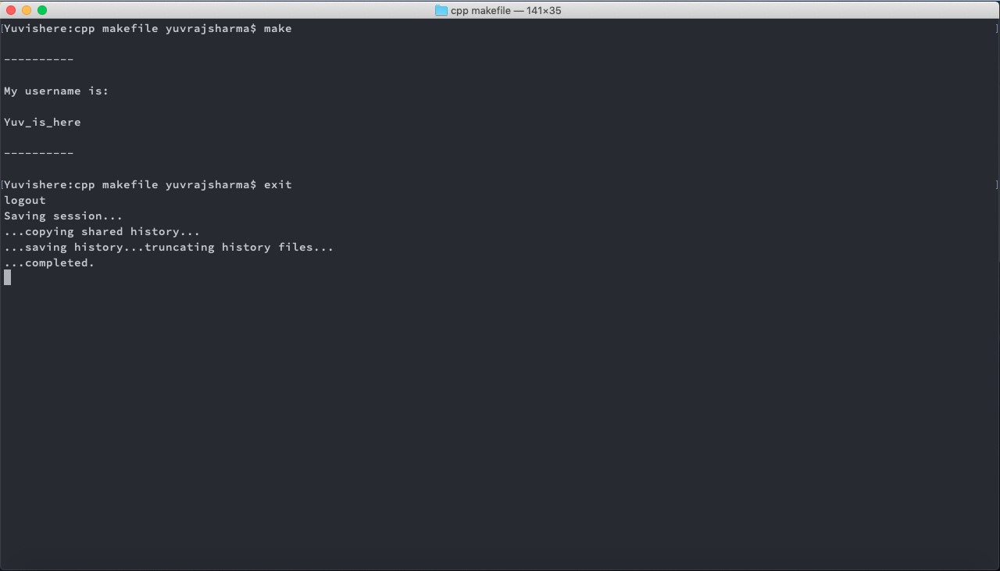

# GCI Task

## Task name
[C/C++] Create your first C/C++ makefile

## Description
This repo is dedicated to the aforementioned task in GCI. The project simply works by executing ```make``` locally.
The makefile script compiles and runs the program, and even deletes the produced output file.

## Demonstration



