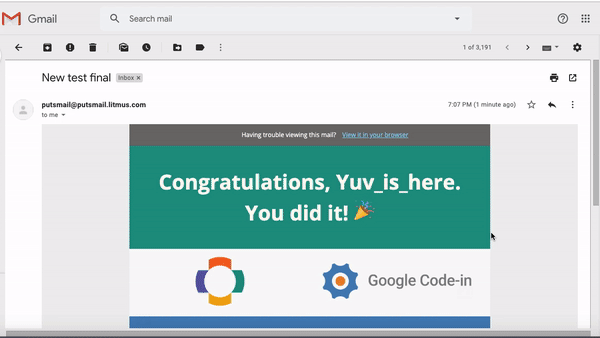
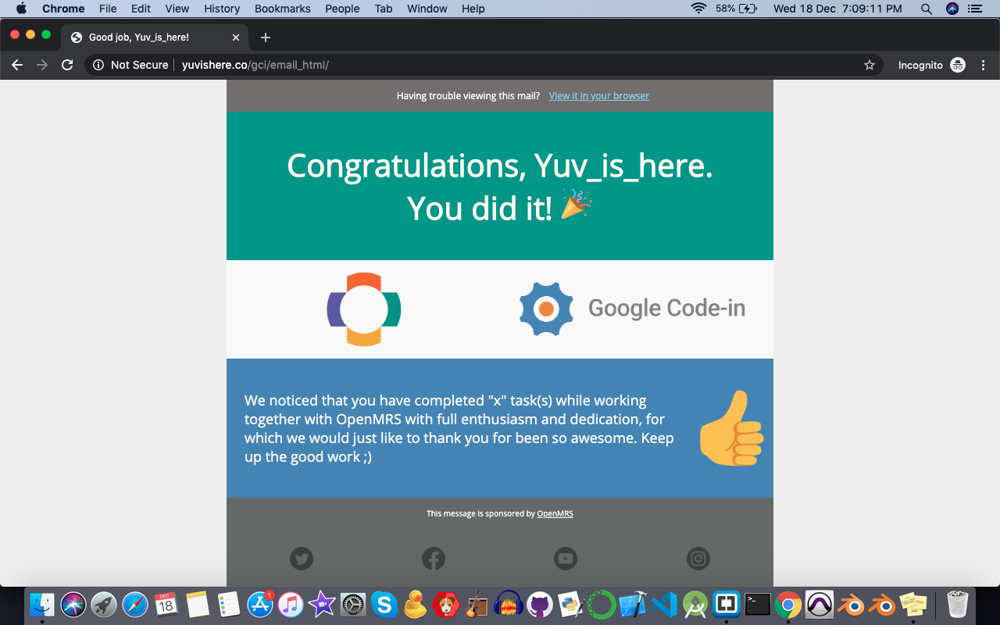
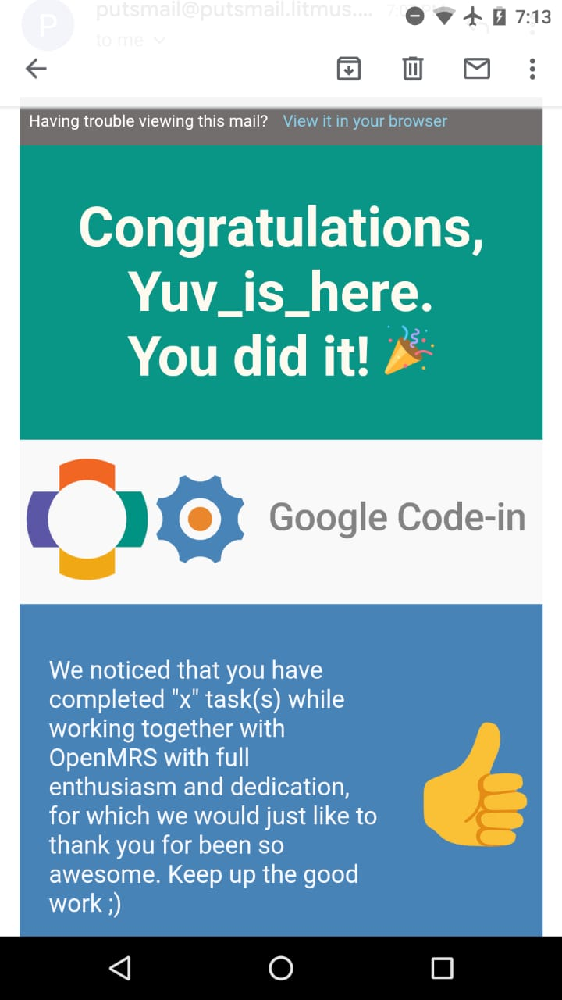

# GCI Task

## Task name
Design a HTML email template to congratulate GCI students

## Description
This repo is dedicated to the aforementioned task in GCI. The project is an email template which is compatible with most of the email renders engines and devices as it also accomodates responsive design.

## Demonstration






## Live Demo
To experience the live demo of the project, you can [Click Here](http://yuvishere.co/gci/email_html)

## Download
To download the source code, simply [Click Here](download.zip)

Or download the zipped folder named ```download.zip```

## Credits
I went through a lot of resources in order to complete this project. Some of them are enlisted below:
- [Litmus Testing](https://putsmail.com/tests/new)
- [iconfinder.com](https://www.iconfinder.com/social-media-icons)
- [Campaign Monitor](https://www.campaignmonitor.com/)
- [Uplers Email](https://email.uplers.com/blog/step-step-guide-create-html-email/)
- [Google Fonts](https://fonts.google.com/)
- [Google Images](https://www.google.co.in/imghp?hl=en&tab=wi&authuser=0&ogbl)